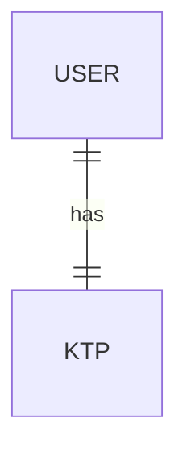
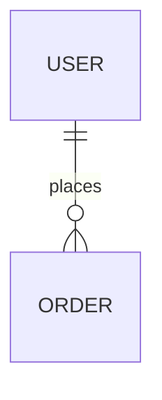
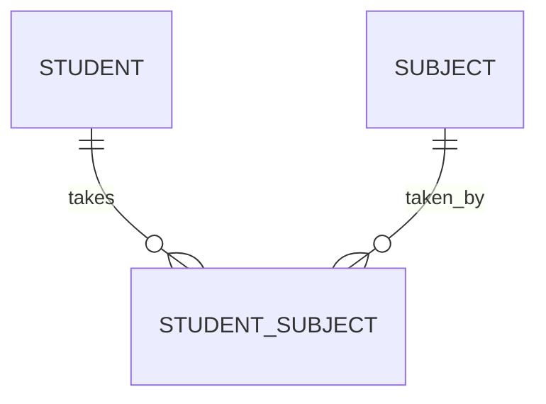

# Pekan 2 - Hari 8: PostgreSQL Menengah (Relasi & Join)

**HARI KE-8** – Menghubungkan Titik-Titik Data
**Fokus hari ini:** Relasi antar tabel, JOIN, dan Query kompleks.

---

## 1. Konsep Relasi Database

Data di dunia nyata saling berhubungan. Di database relasional, kita memisahkan data ke tabel berbeda agar rapi (Normalisasi), lalu menghubungkannya kembali saat dibutuhkan.

### Jenis Relasi

#### 1. One-to-One (1-1)
1 User punya 1 KTP. (Jarang dipakai, biasanya digabung satu tabel).



#### 2. One-to-Many (1-N)
1 User punya Banyak Order. (Paling sering).



#### 3. Many-to-Many (N-N)
1 Siswa ambil Banyak Mapel, 1 Mapel diambil Banyak Siswa.
**PENTING:** Relasi ini TIDAK BISA langsung. Kita butuh **Tabel Penghubung (Pivot Table)**.



Contoh Tabel:
- `students` (id, name)
- `subjects` (id, name)
- `student_subjects` (id, student_id, subject_id) -> **Pivot Table**

---

## 2. Praktik Relasi (One-to-Many)

Mari kita buat sistem User dan Order.

### Buat Tabel Users
```sql
CREATE TABLE users (
    id SERIAL PRIMARY KEY,
    username VARCHAR(50) UNIQUE NOT NULL,
    email VARCHAR(100) UNIQUE NOT NULL
);
```

### Buat Tabel Orders (dengan Foreign Key)
`user_id` adalah kunci tamu (Foreign Key) yang merujuk ke `id` di tabel `users`.
```sql
CREATE TABLE orders (
    id SERIAL PRIMARY KEY,
    total_price DECIMAL(10, 2),
    order_date TIMESTAMP DEFAULT CURRENT_TIMESTAMP,
    user_id INT REFERENCES users(id) ON DELETE CASCADE
);
```
*`ON DELETE CASCADE`: Jika user dihapus, order-nya ikut terhapus otomatis.*

### Isi Data
```sql
INSERT INTO users (username, email) VALUES ('fikri', 'fikri@gmail.com'), ('budi', 'budi@yahoo.com');

-- Fikri belanja 2 kali
INSERT INTO orders (total_price, user_id) VALUES (50000, 1), (120000, 1);
-- Budi belanja 1 kali
INSERT INTO orders (total_price, user_id) VALUES (75000, 2);
```

---

## 3. Mengambil Data Relasi (JOIN)

Bagaimana cara melihat "Siapa belanja apa?"? Pakai `JOIN`.

### INNER JOIN
Hanya menampilkan data yang punya pasangan.
```sql
SELECT users.username, orders.id as order_id, orders.total_price
FROM users
JOIN orders ON users.id = orders.user_id;
```

### LEFT JOIN
Menampilkan semua data tabel kiri (users), walaupun tidak punya pasangan di kanan (orders).
```sql
-- Misal ada user baru yang belum belanja
INSERT INTO users (username, email) VALUES ('ani', 'ani@gmail.com');

SELECT users.username, orders.total_price
FROM users
LEFT JOIN orders ON users.id = orders.user_id;
-- Ani akan muncul dengan total_price NULL
```

---

## 4. Aggregation & Grouping

Menghitung data statistik.

```sql
-- Hitung total belanjaan per user
SELECT users.username, COUNT(orders.id) as jumlah_transaksi, SUM(orders.total_price) as total_belanja
FROM users
JOIN orders ON users.id = orders.user_id
GROUP BY users.username;
```

### HAVING (Filter setelah Grouping)
Kalau `WHERE` memfilter data mentah, `HAVING` memfilter hasil agregasi.
Contoh: Cari user yang total belanjanya di atas 100.000.

```sql
SELECT users.username, SUM(orders.total_price) as total_belanja
FROM users
JOIN orders ON users.id = orders.user_id
GROUP BY users.username
HAVING SUM(orders.total_price) > 100000;
```

### DISTINCT (Menghilangkan Duplikat)
Kalau mau lihat siapa saja yang pernah belanja (tanpa nama kembar).
```sql
SELECT DISTINCT username FROM users 
JOIN orders ON users.id = orders.user_id;
```

---

## 5. Pagination (Limit & Offset)

Penting untuk performa aplikasi, jangan ambil 1 juta data sekaligus!

```sql
-- Ambil 5 data saja (LIMIT)
SELECT * FROM products LIMIT 5;

-- Ambil 5 data, tapi lewati 10 data pertama (Halaman 3 kalau per halamannya 5)
SELECT * FROM products LIMIT 5 OFFSET 10;
```

---

## 6. Tugas Harian Hari Ke-8

**Skenario:** Lanjutkan database `toko_laptop_db` kemarin.

1.  **Buat Tabel `categories`:**
    - `id`, `name`.
2.  **Alter Tabel `items`:**
    - Tambahkan kolom `category_id` (INT).
    - Set sebagai Foreign Key ke `categories(id)`.
3.  **Isi Data:**
    - Buat 3 kategori (Laptop, Mouse, Keyboard).
    - Update data `items` yang sudah ada agar memiliki `category_id` yang sesuai.
4.  **Query JOIN:**
    - Tampilkan daftar barang beserta nama kategorinya (bukan ID-nya).
5.  **Query Aggregation:**
    - Hitung berapa jumlah barang di setiap kategori.
    - Cari kategori mana yang punya barang termahal.

**Checklist:**
- [ ] Paham konsep Foreign Key.
- [ ] Bisa melakukan INNER JOIN.
- [ ] Bisa melakukan GROUP BY.
- [ ] Mengerti kenapa Pagination itu penting.

---

**Tips:** Relasi adalah kekuatan utama SQL. Pahami betul konsep "siapa punya siapa". 🔗

---

## 7. Kuis Pilihan Ganda (Latihan)

1. **Relasi antara "Penulis" dan "Buku" (Satu penulis bisa menulis banyak buku) adalah...**
   a. One-to-One
   b. One-to-Many
   c. Many-to-Many
   d. Many-to-One

2. **Apa fungsi `FOREIGN KEY`?**
   a. Kunci utama tabel
   b. Menghubungkan satu tabel ke tabel lain
   c. Mengunci tabel agar tidak bisa diedit
   d. Menghapus data otomatis

3. **Jika kita ingin mengambil data dari dua tabel yang saling berhubungan, kita menggunakan perintah...**
   a. MERGE
   b. CONNECT
   c. JOIN
   d. LINK

4. **Jenis JOIN yang hanya menampilkan data jika kedua tabel memiliki pasangan adalah...**
   a. LEFT JOIN
   b. RIGHT JOIN
   c. INNER JOIN
   d. FULL JOIN

5. **Apa yang terjadi pada `LEFT JOIN` jika data di tabel kanan tidak ditemukan?**
   a. Baris data tidak ditampilkan
   b. Data tabel kanan berisi `NULL`
   c. Error
   d. Data tabel kiri terhapus

6. **Fungsi agregasi untuk menghitung jumlah baris data adalah...**
   a. SUM()
   b. AVG()
   c. COUNT()
   d. MAX()

7. **Perintah `GROUP BY` biasanya digunakan bersamaan dengan...**
   a. INSERT
   b. DELETE
   c. Fungsi Agregasi (COUNT, SUM, dll)
   d. UPDATE

8. **Untuk memfilter hasil setelah melakukan `GROUP BY`, kita menggunakan...**
   a. WHERE
   b. HAVING
   c. LIMIT
   d. ORDER BY

9. **Apa kegunaan `LIMIT` dan `OFFSET`?**
   a. Untuk validasi data
   b. Untuk membuat relasi
   c. Untuk Pagination (Halaman)
   d. Untuk mengurutkan data

10. **Dalam relasi Many-to-Many, kita membutuhkan...**
    a. 1 Tabel saja
    b. 2 Tabel saja
    c. 3 Tabel (1 tabel pivot/penghubung)
    d. Tidak bisa dilakukan di SQL
